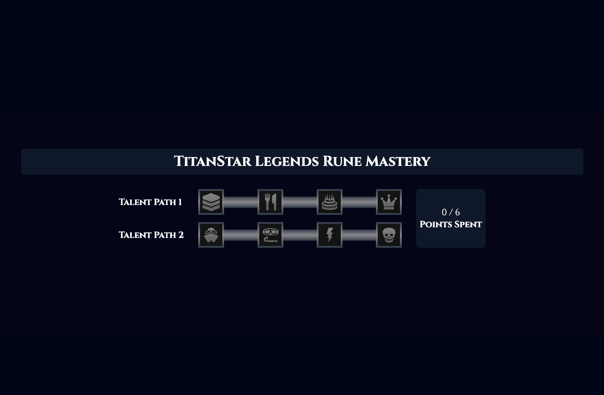
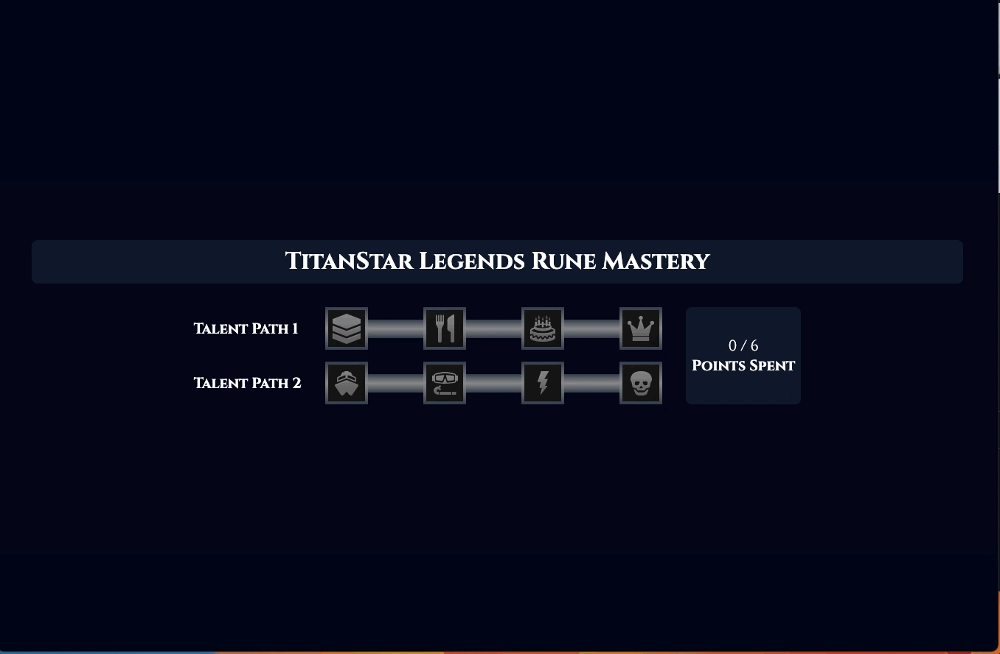
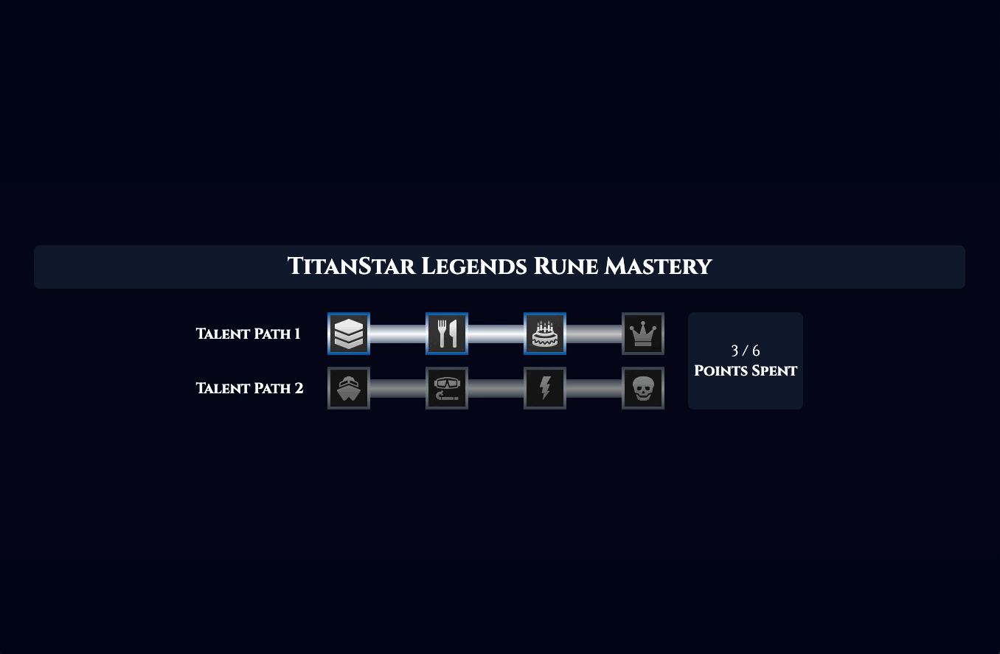
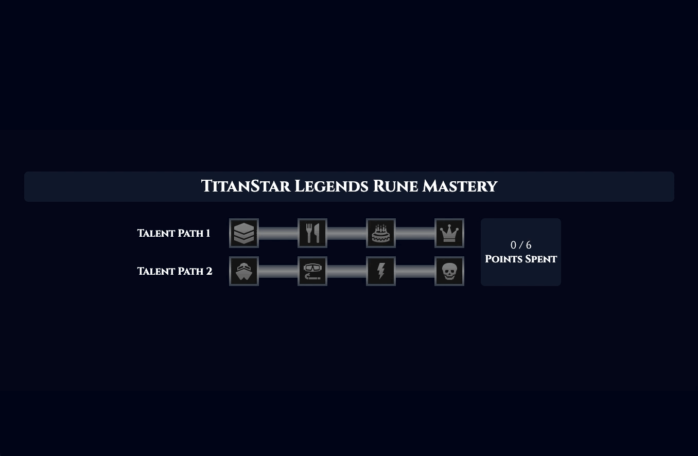
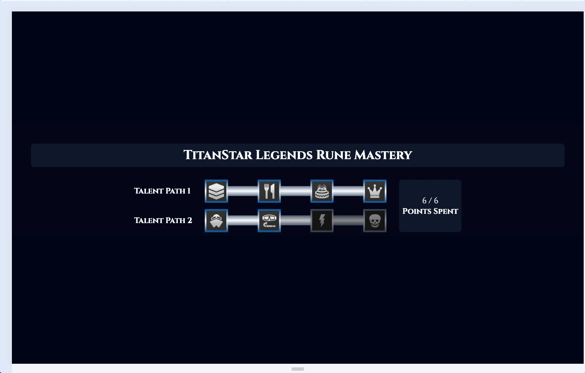

<p align="center">
    
</p>

## Overview

TitanStar Legends is a responsive React application designed to allow players to manage their runes.

## Technology

- 
- 

## Features

<details>
<summary>Learn Runes</summary>
<p align="center">
    
</p>
</details>

<details>
<summary>Reset Runes</summary>
<p align="center">
    
</p>
</details>

<details>
<summary>Toast Notifications</summary>
<p align="center">
    
</p>
</details>

<details>
<summary>Responsive Design</summary>
<p align="center">
    
</p>
</details>

## Getting Started

### Prerequisites

- npm

### Installation

```sh
git clone https://github.com/klam2k20/TitanStar-Legends.git

# Install dependencies
npm install

# Start the application
npm run start
```
